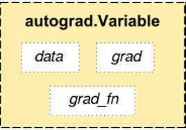

# Basics

## Installation

### update
pip install --upgrade torch torchvision -i https://pypi.douban.com/simple


## Tensor

### basics
print(pytorch_tensor1.shape)
print(pytorch_tensor1.size())
print(pytorch_tensor1.type()) #得到tensor的数据类型
print(pytorch_tensor1.dim()) #得到tensor的维度
print(pytorch_tensor1.numel()) #得到tensor所有元素的个数

### permute
permute可以对任意高维矩阵进行转置.
但没有 torch.permute() 这个调用方式， 只能 Tensor.permute()。
t.rand(2,3,4,5).permute(3,2,0,1).shapeOut[669]: torch.Size([5, 4, 2, 3])

### transpose
transpose只能操作2D矩阵的转置。有两种调用方式。
连续使用transpose也可实现permute的效果。
t.rand(2,3,4,5).transpose(3,0).transpose(2,1).transpose(3,2).shape
Out[672]: torch.Size([5, 4, 2, 3])

### contiguous
contiguous：view只能用在contiguous的variable上。如果在view之前用了transpose, permute等，需要用contiguous()来返回一个contiguous copy。 
一种可能的解释是： 
有些tensor并不是占用一整块内存，而是由不同的数据块组成，而tensor的view()操作依赖于内存是整块的，这时只需要执行contiguous()这个函数，把tensor变成在内存中连续分布的形式。 

## Variable


Variable和Tensor本质上并没有什么区别,variable会被放入一个计算图中.Variable在torch.autograd.Variable中,要将一个tensor转为Varible十分简单,只需Variable(a).

## Parameter

### nn.Paramter是可以更新数值的类，是Variable的子类
```
self为nn.Module的子类
self.register_parameter('loss_weights',nn.Parameter(Variable(torch.zeros(5).cuda(), requires_grad=True)))
loss[idx] = torch.exp(-self.loss_weights[idx])* loss[i] + self.loss_weights[idx]
```

## nn.Module
- [nn.Module的深入分析](https://www.jianshu.com/p/fa59e40698b5)

调用model.train()会把所有的module设置为训练模式，调用model.eval()会把所有的training属性设置为False

## DataSet, DataLoader, Sampler
- Dataset, DataLoader, Sampler三者之间的关系
    - https://www.cnblogs.com/marsggbo/p/11308889.html


### build_dataset

```
data_loaders = [
    build_dataloader(
        ds, cfg.data.imgs_per_gpu, cfg.data.workers_per_gpu, dist=True)
    for ds in dataset
]

data_loader = DataLoader(
    dataset,
    batch_size=batch_size,
    sampler=sampler,
    num_workers=num_workers,
    collate_fn=partial(collate, samples_per_gpu=imgs_per_gpu),
    pin_memory=False,
    **kwargs)    

    
    
```

### 自定义Dataset
我们看一下代码，自定义Dataset只需要最下面一个class,继承自Dataset类。有三个私有函数

def __init__(self, loader=default_loader):

这个里面一般要初始化一个loader(代码见上面),一个images_path的列表，一个target的列表

def __getitem__(self, index)：

这里吗就是在给你一个index的时候，你返回一个图片的tensor和target的tensor,使用了loader方法，经过 归一化，剪裁，类型转化，从图像变成tensor

def __len__(self):

return你所有数据的个数

这三个综合起来看呢，其实就是你告诉它你所有数据的长度，它每次给你返回一个shuffle过的index,以这个方式遍历数据集，通过 __getitem__(self, index)返回一组你要的（input,target）

### Dataloader
实例化一个dataset,然后用Dataloader 包起来
```
train_data  = trainset()
trainloader = DataLoader(train_data, batch_size=4,shuffle=True)
```

### Sampler


## 函数

### F.softmax
b = F.softmax(input,dim=0) # 按列SoftMax,列和为1
F.softmax(input,dim=1)   # 按行SoftMax,行和为1

### squeeze()和unsqueeze()
torch.unsqueeze(gt_semantic, 1)

